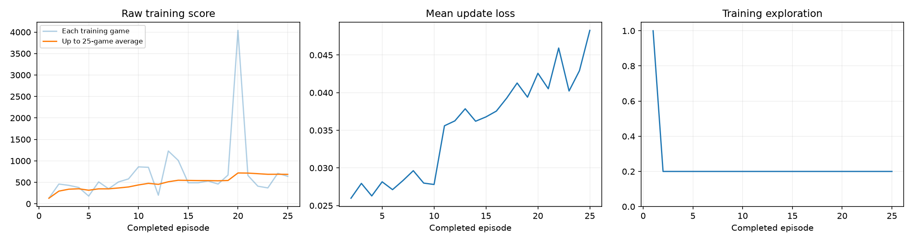
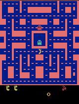
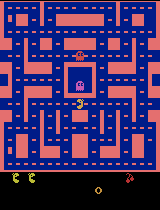

# Ms. Pac-Man DQN — Class 3 submission

Graciela de Leon's submission for the Class 3 "Train a Ms. Pac-Man Agent" assignment. This forks
[pepealonso95/pacman-dqn](https://github.com/pepealonso95/pacman-dqn) and adds one executed
training run plus this README as the graded evidence.

## Open and run

Open [`pacman_dqn.ipynb`](pacman_dqn.ipynb) (already executed with outputs — no rerun needed to see
the results) in Jupyter, VS Code, or
[Google Colab](https://colab.research.google.com/github/gracielaaaaa/pacman-dqn/blob/main/pacman_dqn.ipynb).
Section 1 holds the three chosen hyperparameters; Section 2's setup cell documents why the
installed package versions differ from the notebook's defaults (see **Hardware note** below).
To reproduce from scratch, edit nothing and choose Run All — the notebook regenerates the same
settings and creates a fresh timestamped run folder under `pacman_runs/`.

## My three choices, and why

| Setting | Value | Why |
|---|---|---|
| Exploration | **0.20** | The notebook's balanced starting point — enough randomness after warm-up to keep discovering the maze without drowning the learned policy in noise over a short run. |
| Episodes | **25** | Enough to cross the 25-episode threshold that unlocks an intermediate checkpoint/GIF and to see a real training trend, while staying inside a few minutes on a CPU-only laptop (no CUDA/MPS available — see below). |
| Learning rate | **0.0001** | The notebook's reference default for Adam on this network size — a safe starting point rather than risking instability on a first real run. |

## Hardware note (why package versions differ from the notebook's defaults)

This ran on an **Intel Mac (x86_64, i7-1068NG7, CPU only — no CUDA, no Apple MPS)**. PyTorch
stopped publishing Intel-macOS wheels after **2.2.2**, and torch 2.2.2 needs `numpy<2`, while the
notebook's pinned `opencv-python-headless==4.14.0.94` and current `matplotlib` want `numpy>=2`.
Section 2's setup cell installs the newest mutually-compatible set for this hardware —
`torch==2.2.2`, `numpy==1.26.4`, everything else unchanged — instead of the notebook's
`torch>=2.6` default. None of this touches the training/evaluation code or the three chosen
hyperparameters. The exact versions actually used are recorded in
[`results/config.json`](results/config.json).

## What I expected vs. what happened

**Expected:** with only 25 episodes (well short of the notebook's 100-episode default), I expected
modest, noisy improvement at best — DQN on raw Atari pixels typically needs far more experience
than ~15,000 decisions to converge.

**Observed:** training scores did trend up (25-game average rose from ~150 to ~700, see the
dashboard below), including one standout 4,040-point training game at episode 20. But on the fixed
5-seed evaluation, the trained agent's **mean score fell from 492.0 to 400.0** — a small regression,
not an improvement. The per-update training loss also climbed steadily instead of settling, which
tracks with the eval result: the network was still in an unstable, early phase of learning, not a
converged one.

## Actual run stats

From [`results/training_summary.json`](results/training_summary.json) and
[`results/config.json`](results/config.json):

| | |
|---|---|
| Status | `completed` (not interrupted) |
| Completed episodes | 25 / 25 |
| Total decisions (agent steps) | 14,928 |
| Learning updates | 3,483 |
| Elapsed time | ~284.7 s (≈ 4 min 45 s) |
| Hardware | Intel Mac, CPU (`device: "cpu"`), macOS 26.6.2, x86_64 |
| Software | Python 3.12.14, torch 2.2.2, gymnasium 1.3.0, ale-py 0.11.2 |

## Observations, actions, and rewards, in plain language

- **Observations:** the agent doesn't see game state directly — it sees the **last four game
  screens**, each downscaled to an 84×84 grayscale image. Stacking four consecutive frames lets the
  network infer motion (which way Pac-Man and the ghosts are moving), not just position.
- **Actions:** at every decision, the agent picks one of **9 joystick moves** (up/down/left/right,
  the four diagonals, and no-op). One decision covers 4 real emulator frames (frame skipping).
- **Rewards:** the game's own score — points for eating pellets, power pellets, and (briefly)
  vulnerable ghosts. Training rewards are clipped to [-1, +1] to keep learning stable, but every
  score reported here (and on the leaderboard) is the **raw, unclipped game score**.

## One limitation, and one next experiment

**Limitation:** 25 episodes (~15k decisions, ~3.5k learning updates) is too little experience for
this network to converge — the rising training loss and the eval regression both point to a model
still early in learning, not one that has found a stable policy. With only a 5,000-transition replay
buffer and 5 fixed evaluation seeds, results are also high-variance: a single strong or weak game
(like the 4,040-point outlier at episode 20) can swing the training curve without reflecting a
genuinely better general policy.

**Next experiment:** I'd change only **episodes**, raising it to 100 (the notebook's default) while
keeping exploration and learning rate fixed. That's a ~4x increase in training decisions and should
show whether the upward training-score trend continues past this run's regression on held-out
evaluation seeds, without confounding the change with a different learning rate or exploration
level.

## Evidence

### Training dashboard

### Gameplay GIFs

| Before training (untrained, seed 101) | After 25 episodes (intermediate, seed 101) | Best of 5 trained eval games |
|---|---|---|
|  |  |  |

### All five before/after evaluation scores

Same 5 seeds, same 5% evaluation exploration, same 3,000-decision cap, before and after training.
The baseline is the **untrained network**, not a random-action agent. Full data:
[`results/comparison.json`](results/comparison.json).

| Seed | Before (untrained) | After (25 episodes) |
|---|---|---|
| 101 | 350 | 250 |
| 202 | 500 | 970 |
| 303 | 320 | 220 |
| 404 | 800 | 340 |
| 505 | 490 | 220 |
| **Mean** | **492.0** | **400.0** |

Change in mean score: **-92.0** (no improvement on this run).

## Links

- Executed notebook: [`pacman_dqn.ipynb`](pacman_dqn.ipynb)
- [`results/config.json`](results/config.json) — full run configuration and package versions
- [`results/training.csv`](results/training.csv) — per-episode training log (25 rows)
- [`results/training_summary.json`](results/training_summary.json) — completion status, decisions, updates, elapsed time
- [`results/comparison.json`](results/comparison.json) — full before/after evaluation data
- [`results/baseline.json`](results/baseline.json) — untrained baseline evaluation detail

Model checkpoints (`trained.pt`, `untrained.pt`, `episode_0025.pt`, ~6.4 MB each) are kept in the
local run folder (`pacman_runs/20260915_082657_074240/`) rather than in this repo, per the
notebook's own guidance to keep large checkpoints out of git.

## Scope

This is the classroom DQN as provided — no changes to the network, replay memory, or learning
rule, only the three assigned hyperparameters, plus the package-version and `SHOW_POPUPS=False`
adjustments explained above (needed for headless local execution on this hardware, unrelated to
the graded hyperparameters).
